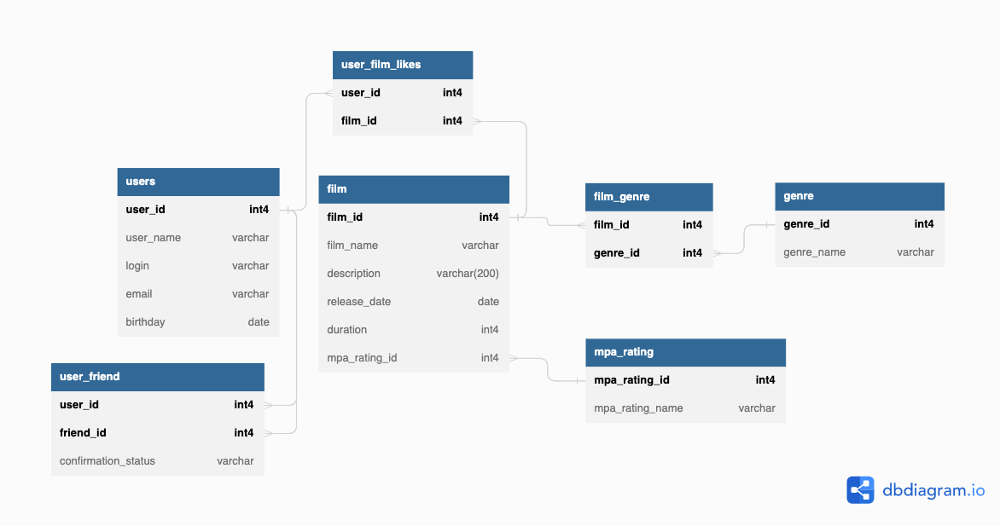

# java-filmorate
## summary
Это мой второй большой проект в рамках обучения Java на платформе Яндекс Практикум. 

Основная цель этого приложения - помочь пользователю найти фильм 
для просмотра ориентируясь на лайки и найти друзей по интересам

## main educational purposes
- Освоить framework Spring Boot
  - Система сборки Maven и управление внешними зависимостями с помощью pom.xml
  - REST API
    - Обработка RequestBody / PathVariable / RequestParam
    - Валидация данных и обработка исключений
  - Логирование (Slf4j)
  - Lombok
  - Dependencies Injection в Spring
- Работа с БД
  - Освоить основы SQL
  - Спроектировать схему БД проекта

## database scheme

### comments
- Основные таблицы:
  - user: пользователи сервиса
  - film: список фильмов
- Справочники:
  - user
    - confirmation_status: статус заявок в друзья
  - film
    - genre: жанры для фильмов
    - mpa_rating: возрастной рейтинг фильмов
- Связующие таблицы
  - user_friend: какие из других пользователей являются друзьями
  - user_film_likes: пользователи, которым понравился фильм
  - film_genre: жанры фильма

### SQL requests samples
[Sample SQL requests](/SQL_samles.sql)

